# Unimed-Cloud-Plus 微服务系统

## 变更记录 (Changelog)

- **2025-12-16 09:30:24** - 初始化项目 AI 上下文，完成全仓架构分析和模块识别

## 项目愿景

Unimed-Cloud-Plus 是基于 Dromara 生态构建的企业级微服务系统，整合了认证授权、网关路由、系统管理、数字人服务、工作流引擎等核心功能，为医疗健康领域提供完整的数字化解决方案。

## 架构总览

### 技术栈
- **框架**: Spring Boot 3.5.7 + Spring Cloud 2025.0.0
- **微服务**: Spring Cloud Gateway + Nacos + Dubbo
- **数据库**: MySQL + MyBatis-Plus 3.5.14
- **缓存**: Redis + Redisson 3.51.0
- **认证**: Sa-Token 1.44.0
- **工作流**: Warm-Flow 1.8.2
- **监控**: Spring Boot Admin 3.5.5 + Prometheus
- **消息队列**: RocketMQ 2.3.4
- **文档**: SpringDoc OpenAPI 2.8.13

### 架构模式
- **微服务架构**: 基于 Spring Cloud 的分布式系统
- **服务治理**: Nacos 作为注册中心和配置中心
- **API 网关**: Spring Cloud Gateway 统一入口
- **服务通信**: Dubbo RPC + REST API
- **数据一致性**: Seata 分布式事务
- **多租户**: 内置租户隔离机制

## 模块结构图

```mermaid
graph TD
    A["(根) Unimed-Cloud-Plus"] --> B["unimed-auth"];
    A --> C["unimed-gateway"];
    A --> D["unimed-modules"];
    A --> E["unimed-api"];
    A --> F["unimed-common"];
    A --> G["unimed-visual"];
    A --> H["unimed-example"];

    D --> I["unimed-system"];
    D --> J["unimed-gen"];
    D --> K["unimed-job"];
    D --> L["unimed-resource"];
    D --> M["unimed-workflow"];
    D --> N["unimed-dh"];

    E --> O["unimed-api-system"];
    E --> P["unimed-api-resource"];
    E --> Q["unimed-api-workflow"];
    E --> R["unimed-api-auth"];

    G --> S["unimed-monitor"];
    G --> T["unimed-nacos"];
    G --> U["unimed-seata-server"];
    G --> V["unimed-snailjob-server"];

    H --> W["unimed-demo"];
    H --> X["unimed-test-mq"];

    click B "./unimed-auth/CLAUDE.md" "查看认证授权模块文档"
    click C "./unimed-gateway/CLAUDE.md" "查看网关模块文档"
    click I "./unimed-modules/unimed-system/CLAUDE.md" "查看系统管理模块文档"
    click J "./unimed-modules/unimed-gen/CLAUDE.md" "查看代码生成模块文档"
    click K "./unimed-modules/unimed-job/CLAUDE.md" "查看任务调度模块文档"
    click L "./unimed-modules/unimed-resource/CLAUDE.md" "查看资源服务模块文档"
    click M "./unimed-modules/unimed-workflow/CLAUDE.md" "查看工作流模块文档"
    click N "./unimed-modules/unimed-dh/CLAUDE.md" "查看数字人模块文档"
    click S "./unimed-visual/unimed-monitor/CLAUDE.md" "查看监控服务文档"
```



## 模块索引

| 模块路径 | 模块名称 | 端口 | 主要职责 | 技术特点 |
|---------|---------|------|----------|----------|
| unimed-auth | 认证授权中心 | 9221 | 用户认证、权限管理、租户管理 | Sa-Token、OAuth2、多租户 |
| unimed-gateway | API 网关 | 9200 | 路由转发、负载均衡、限流熔断 | Spring Cloud Gateway、Redis |
| unimed-modules/unimed-system | 系统管理 | 9201 | 用户、角色、菜单、字典管理 | MyBatis-Plus、数据权限 |
| unimed-modules/unimed-gen | 代码生成 | 9202 | 代码模板、表结构管理 | Velocity、Freemarker |
| unimed-modules/unimed-job | 任务调度 | 9203 | 定时任务、分布式任务 | SnailJob、XXL-Job |
| unimed-modules/unimed-resource | 资源服务 | 9204 | 文件存储、OSS、邮件短信 | AWS S3、阿里云OSS |
| unimed-modules/unimed-dh | 数字人服务 | 9205 | 数字人配置、WebRTC通信 | WebRTC、API鉴权 |
| unimed-modules/unimed-workflow | 工作流 | 9206 | 流程引擎、任务管理 | Warm-Flow、Activiti |
| unimed-visual/unimed-monitor | 监控中心 | 9100 | 系统监控、日志分析 | Spring Boot Admin |
| unimed-visual/unimed-nacos | 注册中心 | 8848 | 服务注册、配置管理 | Nacos |

## 运行与开发

### 环境要求
- JDK 17+
- Maven 3.6+
- MySQL 8.0+
- Redis 6.0+
- Node.js 16+ (前端)

### 启动顺序
1. **基础设施**: Nacos (8848) → MySQL → Redis
2. **核心服务**: unimed-auth (9221) → unimed-gateway (9200)
3. **业务模块**: unimed-system (9201) → unimed-resource (9204) → unimed-workflow (9206)
4. **扩展功能**: unimed-dh (9205) → unimed-job (9203)
5. **监控工具**: unimed-monitor (9100)

### 开发配置
```yaml
# 开发环境配置
spring:
  profiles:
    active: dev
  cloud:
    nacos:
      server-addr: 127.0.0.1:8848
      username: nacos
      password: nacos
```

## 测试策略

### 测试分层
- **单元测试**: Service 层业务逻辑测试，使用 JUnit 5 + Mockito
- **集成测试**: Controller 层 API 测试，使用 @SpringBootTest
- **接口测试**: 使用 Postman/Swagger 进行 API 测试
- **性能测试**: 使用 JMeter 进行压力测试

### 测试环境
- **开发环境**: 本地 Docker 容器化部署
- **测试环境**: Kubernetes 集群部署
- **预生产环境**: 与生产环境一致的配置

## 编码规范

### 代码风格
- **Java**: 遵循 Alibaba Java Coding Guidelines
- **命名**: 使用驼峰命名法，类名首字母大写
- **注释**: 使用 Javadoc 标准注释格式
- **异常**: 统一使用 R<T> 返回结果包装

### 数据库规范
- **表名**: 使用小写字母和下划线，如 `sys_user`
- **字段名**: 使用小写字母和下划线，如 `user_name`
- **主键**: 统一使用 `id` 作为主键，类型为 `bigint`
- **审计字段**: `create_time`、`update_time`、`create_by`、`update_by`

### API 设计规范
- **RESTful**: 遵循 REST 设计原则
- **版本控制**: 使用 URL 路径版本控制，如 `/api/v1/`
- **统一响应**: 使用 `R<T>` 包装响应结果
- **错误码**: 使用枚举定义错误码和错误信息

## AI 使用指引

### 代码生成
1. 使用 unimed-gen 模块进行代码生成
2. 支持单表、主子表、树表生成
3. 可自定义模板和代码风格

### 智能提示
- **业务逻辑**: 参考现有模块的实现模式
- **数据库设计**: 参考系统模块的表结构设计
- **API 设计**: 参考系统模块的 Controller 设计
- **权限控制**: 使用 `@SaCheckPermission` 注解

### 常见场景
- **新增业务模块**: 复制 unimed-system 模块结构
- **新增 API**: 参考 SysUserController 的实现
- **数据权限**: 使用 `@DataPermission` 注解
- **多租户**: 使用 `TenantHelper` 工具类

## 相关链接

- **项目地址**: https://gitee.com/dromara/Unimed-Cloud-Plus
- **文档中心**: http://localhost:9100/doc.html
- **监控中心**: http://localhost:9100
- **注册中心**: http://localhost:8848/nacos
- **API 文档**: http://localhost:9200/doc.html