# Unimed-Cloud-Plus 微服务系统

## 变更记录 (Changelog)

- **2026-04-07** - 方言采集模块上线：新增 4 个控制器（DhDialectPrompt/DhDialectRecord/DhDialectInvite/PortalDialect）；3 张新表（dh_dialect_prompt/dh_dialect_record/dh_dialect_invite）；支持匿名提交、录音上传、邀请码管理、批量导入排序
- **2026-03-04（第三次更新）** - unimed-dh 新增 B 端控制器（音色/素材/背景/生产/报表）和 C 端门户（认证/会员/钱包/充值/订单/创作/声音克隆）
- **2026-03-04 09:57:40** - 识别 unimed-dh-relay、unimed-dh 重构为 dhcore、新增 unimed-api-auth
- **2025-12-16 09:30:24** - 初始化项目 AI 上下文

## 项目愿景

基于 Dromara 生态的企业级微服务系统，整合认证授权、网关路由、系统管理、数字人服务、工作流引擎，为医疗健康领域提供完整数字化解决方案。

## 架构总览

**技术栈**: Spring Boot 3.5.7 + Spring Cloud 2025.0.0 | Nacos + Dubbo | MySQL + MyBatis-Plus 3.5.14 | Redis + Redisson | Sa-Token 1.44.0 | Warm-Flow 1.8.2 | RocketMQ 2.3.4 | WebFlux

**架构模式**: 微服务 + Nacos 注册/配置 + Gateway 统一入口 + Dubbo RPC + Seata 分布式事务 + 多租户隔离

## 模块结构图

```mermaid
graph TD
    A["(根) Unimed-Cloud-Plus"] --> B["unimed-auth"];
    A --> C["unimed-gateway"];
    A --> D["unimed-modules"];
    A --> Y["unimed-dh"];
    A --> Z["unimed-chronic"];
    A --> E["unimed-api"];
    A --> F["unimed-common"];
    A --> G["unimed-visual"];
    A --> H["unimed-example"];
    D --> I["unimed-system"];
    D --> J["unimed-gen"];
    D --> K["unimed-job"];
    D --> L["unimed-resource"];
    D --> M["unimed-workflow"];
    Y --> N["unimed-dh-core"];
    Y --> O["unimed-dh-relay"];
    Z --> ZA["unimed-chronic-api"];
    Z --> ZB["unimed-chronic-biz"];
    E --> P["unimed-api-system"];
    E --> Q["unimed-api-resource"];
    E --> R["unimed-api-workflow"];
    E --> S["unimed-api-auth"];
    G --> T["unimed-monitor"];
    G --> U["unimed-nacos"];
    G --> V["unimed-seata-server"];
    G --> W["unimed-snailjob-server"];
    H --> X["unimed-demo"];

    click B "./unimed-auth/CLAUDE.md" "认证授权"
    click C "./unimed-gateway/CLAUDE.md" "网关"
    click I "./unimed-modules/unimed-system/CLAUDE.md" "系统管理"
    click M "./unimed-modules/unimed-workflow/CLAUDE.md" "工作流"
    click N "./unimed-dh/unimed-dh-core/CLAUDE.md" "数字人业务"
    click O "./unimed-dh/unimed-dh-relay/CLAUDE.md" "数字人中转"
    click S "./unimed-visual/unimed-monitor/CLAUDE.md" "监控"
```



## 模块索引

| 模块路径 | 名称 | 端口 | 职责 |
|---------|------|------|------|
| unimed-auth | 认证授权中心 | 9221 | 用户认证、权限管理、租户管理、API Token |
| unimed-gateway | API 网关 | 9200 | 路由转发、限流熔断 |
| unimed-modules/unimed-system | 系统管理 | 9201 | 用户/角色/菜单/字典/租户 |
| unimed-modules/unimed-gen | 代码生成 | 9202 | 代码模板、表结构管理 |
| unimed-modules/unimed-job | 任务调度 | 9203 | 定时任务、分布式任务 |
| unimed-modules/unimed-resource | 资源服务 | 9204 | 文件存储、OSS、邮件短信 |
| unimed-dh/unimed-dh-relay | 数字人中转 | 9205 | API 中转、WebRTC、AI 对话 |
| unimed-dh/unimed-dh-core | 数字人业务 | 9206 | B端管理+C端门户+方言采集（dhcore 包） |
| unimed-chronic/unimed-chronic-api | 慢病接口 | - | 慢病域 API 骨架 |
| unimed-chronic/unimed-chronic-biz | 慢病业务 | - | 慢病域业务骨架 |
| unimed-modules/unimed-workflow | 工作流 | 9207 | 流程定义、任务管理 |
| unimed-visual/unimed-monitor | 监控中心 | 9100 | Spring Boot Admin |
| unimed-visual/unimed-nacos | 注册中心 | 8848 | Nacos |
| unimed-visual/unimed-seata-server | 分布式事务 | - | Seata |
| unimed-visual/unimed-snailjob-server | 任务调度中心 | - | SnailJob |
| unimed-example/unimed-demo | 示例模块 | - | 功能演示 |
| unimed-example/unimed-test-mq | MQ 测试 | - | RocketMQ/RabbitMQ/Kafka |

### API 模块（跨服务接口）

| 模块 | 主要接口 |
|------|----------|
| unimed-api-system | RemoteUserService、RemoteRoleService、RemoteTenantService、RemoteDictService |
| unimed-api-resource | RemoteFileService |
| unimed-api-workflow | RemoteWorkflowService |
| unimed-api-auth | RemoteTokenService |

### unimed-common 子模块（32 个）

unimed-common-core、unimed-common-web、unimed-common-security、unimed-common-mybatis、unimed-common-redis、unimed-common-nacos、unimed-common-dubbo、unimed-common-log、unimed-common-doc、unimed-common-excel、unimed-common-encrypt、unimed-common-sensitive、unimed-common-translation、unimed-common-tenant、unimed-common-idempotent、unimed-common-ratelimiter、unimed-common-lock、unimed-common-job、unimed-common-mail、unimed-common-sms、unimed-common-oss、unimed-common-websocket、unimed-common-seata、unimed-common-rocketmq、unimed-common-satoken、unimed-common-loadbalancer、unimed-common-logstash、unimed-common-skylog、unimed-common-prometheus 等

## 运行与开发

### 启动顺序
1. 基础设施: Nacos (8848) -> MySQL -> Redis
2. 核心服务: unimed-auth (9221) -> unimed-gateway (9200)
3. 业务模块: unimed-system (9201) -> unimed-resource (9204) -> unimed-workflow (9207)
4. 扩展功能: unimed-dh-relay (9205) -> unimed-dh (9206) -> unimed-job (9203)
5. 监控工具: unimed-monitor (9100)

### 构建命令
```bash
mvn clean package -DskipTests
mvn clean package -pl unimed-dh/unimed-dh-core -am -DskipTests
mvn clean package -Pprod -DskipTests
```

### Docker 部署
所有可部署服务均提供 Dockerfile，基于 `eclipse-temurin:17-jre-alpine`。基础设施通过 `script/docker/docker-compose.yml` 一键部署。

## 测试策略

- **unimed-dh-relay**: 3 个测试文件（WebRtcServiceTest、ChatServiceTest、DigitalHumanDeleteServiceTest）
- **unimed-demo**: 5 个测试文件（AssertUnitTest、DemoUnitTest、ParamUnitTest、TagUnitTest、TOrderTest）
- 其他业务模块暂无专属测试文件

## 编码规范

### 分层架构
```
module/
  controller/     -- B 端 REST API（@SaCheckPermission）
    portal/       -- C 端门户接口（@SaCheckLogin）
  domain/bo|vo|dto|convert/
  mapper/  service/impl/  config/
```

### 关键规范
- 表名/字段名: 小写下划线，主键 `id` bigint，审计字段 create_time/update_time/create_by/update_by
- 统一响应: `R<T>`，分页: `TableDataInfo<T>` + `PageQuery`
- 权限: B 端 `@SaCheckPermission("module:entity:action")`，C 端 `@SaCheckLogin`
- 日志: `@Log(title="xxx", businessType=BusinessType.INSERT)`
- 防重: `@RepeatSubmit()`

## AI 使用指引

- **新增 B 端功能**: 参考 DhOrderController / DhMaterialController 模式
- **新增 C 端接口**: 参考 PortalOrderController / PortalTopupController，放在 `controller/portal/` 下
- **方言采集功能**: 参考 DhDialectPromptController（B端管理）和 PortalDialectController（C端采集）
- **跨服务调用**: 在 unimed-api 定义接口，实现端 `@DubboService`，调用端 `@DubboReference`
- **响应式服务**: 参考 unimed-dh-relay 的 WebClient + Mono 模式
- **数字人数据库**: 参考 `script/sql/update/dh-*.sql` 历史变更脚本

### 关键基类
- `BaseController` - 控制器基类
- `R<T>` - 统一响应（unimed-common-core）
- `BaseEntity` - 审计字段基类
- `TenantEntity` - 租户实体基类

## 相关链接

- API 文档: http://localhost:9200/doc.html
- 监控中心: http://localhost:9100
- 注册中心: http://localhost:8848/nacos
