# Unimed-Cloud-Plus 微服务系统

## 变更记录 (Changelog)

- **2026-09-02** - 随访病种主数据补齐 + 取消 GENERAL「通用兜底」规则档：①【修实际故障】`ch_disease_config` 缺 `STROKE`(脑卒中)/`TUMOR`(恶性肿瘤) 两行，而 `ch_followup_rule`(STROKE 4 行/TUMOR 1 行) 与 `ch_followup_questionnaire`(问卷 7/9) 早已在用这两个码。病种中文名唯一来源 `DiseaseNameHelper.batchGetDiseaseName()` 只查该表，查不到即 `diseaseName=null`，14 处调用点（规则/计划/任务/问卷/派单池/管理计划/风险评估/预警规则/诊疗记录/患者档案/随访统计）全部退化为裸显英文码；更实际的影响是管理端问卷页 `ensureDiseaseOptions()` 同读该表，STROKE/TUMOR 问卷**既筛不出也选不到**。`STROKE` 在 `script/sql/mock/chronic-mock-data.sql:150` 种子中本已存在（dev 库漏同步，`ch_disease_relation` 的 HTN→STROKE 也缺），`TUMOR` 种子从未提供（属漏配）。新增 `script/sql/update/chronic-disease-config-stroke-tumor.sql`：病种表走 `uk_disease_code` 的 `ON DUPLICATE KEY UPDATE`（含 `del_flag`/`is_active` 复位，可救被软删的行），关系表与 `chronic_disease_type` 字典（前端兜底数据源，原 6 条→8 条）走 `WHERE NOT EXISTS`；`monitor_items` 仅病种配置页展示、无后端解析，沿用库内存量命名风格（SBP/DBP/HR/WEIGHT/TEMP）不引入新词表，`followup_template_id` 与存量 9 行一致保持 NULL 不臆造问卷绑定。②【按产品决策移除 GENERAL 兜底】`GENERAL` 不是病种而是 `FollowupRuleEngine.matchRule()` 四级回退链的最后两级（`(病种,等级)→(病种,ANY)→(GENERAL,等级)→(GENERAL,ANY)`），写入病种主数据会污染「患者确诊病种」下拉并在按病种统计中多出假病种，故改为整档取消：`matchRule()` 收敛为两级且病种不同（含空码）一律不参与匹配；`normalize(null)` 由 `"GENERAL"` 改 `""`；`MultiDiseaseFollowupMerger` 空病种分支不再伪造 `GENERAL` 病种码（病种留空 + 引擎内置默认档，该分支经核查从唯一调用方 `FollowupEnrollmentManager:120` 不可达，属防御性代码）；`ChFollowupRuleServiceImpl.normalizeCode` 同步去默认值（`ChFollowupRuleBo.diseaseCode` 本有 `@NotBlank`）；前端 `rule/data.ts` 移除 GENERAL 选项与占位文案、补 8 个真实病种预设供接口失败兜底；种子 `chronic-followup-rule-config.sql` 删 GENERAL 行并改注释；新增 `script/sql/update/chronic-followup-drop-general-rule.sql` 删除存量行（dev 库 id=24，已执行，规则 24→23）。**零行为回归论证**：被删行 90/1/7/PHONE/「通用慢病规范化随访管理:每3个月随访1次(每年4次)。」与内置 `switch default` 逐字段相同，且 `resolveQuestionnaireId` 两条路径都按真实病种码查询，故未配规则病种（ASTHMA/HTN_HEART/DM_NEPHRO/病种为空）推导结果不变；`(GENERAL,等级)` 一级库内从未有数据。代价：未配规则病种的通用默认从此只能改代码，运营侧不再有可配置「通用档」入口。③单测：`FollowupRuleEngineTest` 两个 GENERAL 用例改写为「病种ANY优先于内置默认且不跨病种误匹配」「未配规则病种走内置默认档」「病种为空不产生 GENERAL 伪码」，慢病模块 90 用例全绿。④【遗留未修，已上报】`DashboardManager.FIRST_PHASE_DISEASE_CODES` 使用另一套码 `HYPERTENSION/DIABETES/ASTHMA/CANCER/MENTAL_DISORDER`，与病种表 `HTN/T2DM/COPD/TUMOR` 不一致，专病人群分页仅 CHD/CKD/STROKE 能命中（高血压/糖尿病/肿瘤恒空），其 `resolveDiseaseName()` 亦硬编码 switch 绕开 `DiseaseNameHelper`；改动会影响仪表盘人群，建议单独提交

- **2026-08-31** - 随访任务改为「医生逐轮驱动」生成:原模型在建档/建计划时按 `total_rounds` 一次性预生成全部轮次(医生尚未看首轮数据就被排定后 3 轮日期),现改为**只生成首轮、每轮随访完成后由医生决定下一轮**。①新增 `FollowupRoundTaskGenerator`(`support/rule/`)作为唯一幂等写入点:`ensureRound` 按 planId+round 去重、`generateNextRound` 沿用上一轮 `visitType`(缺失时回退规则默认再回退 PHONE)、`resolveFirstDueDate`/`resolveVisitType` 统一首轮口径,并校验「下次随访日期不得早于今天」;②四处预生成点全部收敛:`FollowupEnrollmentManager.autoEnrollAndGeneratePlan`(删 `for round<=totalRounds` 循环)、`ChFollowupServiceImpl.generateTasks`、`ChFollowupServiceImpl.syncUnfinishedTasks`(限定 `taskType=NORMAL`、`taskRound` 判空、不再回填后续轮次)、`FollowupTaskGenJob`(删未来轮次生成与 `computeDueDate`,仅对「无任何计划内任务」的 ACTIVE 计划补首轮,计划内判定按 `taskType` 为空或不属于 EMERGENCY/DYNAMIC/REFERRAL_TRACK,避免给存量老计划重复插首轮);③`completeTask` 新增步骤 6.1:`bo.getNextFollowupDate()` 非空则生成下一轮、为空则不再续轮,且**先续轮后 `updatePlanProgress`**(使 `countUnfinishedTasks>0` 把计划留在 ACTIVE),`updatePlanProgress(task, plan)` 改为复用已加载计划、仅在 `taskRound!=null` 时推进 `currentRound`、未完结任务归零时置 COMPLETED 并补记 `FOLLOWUP_PLAN_COMPLETED` 时间线(原为静默改状态);日期解析失败/格式错误抛 `ServiceException`,不再默默丢任务;④【修正同日初版设计】`ch_followup_rule.total_rounds` 不得大于两轮、最终收敛为常量 **1**（语义 = 规则仅生成首轮）：初版把它当「管理目标轮次上限」保留 4/6/12 仍属旧预生成模型残留，与逐轮模型相废。配套摘除 `total_rounds` 的全部硬作用：`updatePlan` 的「总轮次不能小于当前已完成轮次」校验（否则医生续轮后管理员编辑计划必然报错）、`syncUnfinishedTasks` 的 `taskRound > totalRounds` 取消分支、以及**按 `cycle_days` 公式覆写医生所选到期日**的逻辑（`calculateDueDate` 方法删除）——第 2 轮起的 `planDueDate` 是医生临床决策，不得被 `firstDueDate + cycle_days*(round-1)` 静默丢弃；`syncUnfinishedTasks` 对 round≥2 仅同步归属（patientId/assigneeUserId），不再覆写方式与日期；`FollowupRuleEngine` 内置兜底 switch 的 12/6/4 全部改为常量 1；`ChFollowupRuleServiceImpl.validateRule` 不再要求前端传值、统一置 1；⑤文案与口径同步:医生端 `execute.vue` 「下次随访计划」补逐轮生成说明（上限确认弹窗 `confirmRoundCap` 已删除：上限=1 时每轮必弹属噪音，并回退 `ChFollowupTaskVo.totalRounds/planStatus` 与 `fillTaskMetadata` 赋值）；管理端**规则表单/列表直接移除 `totalRounds` 配置项**（配了不生效即隐藏机制）、`cycleDays` 改标「建议间隔(天)」、计划抽屉默认值 4→1 并改标「管理目标轮次(仅进度参考)」；列表轮次列改「已完成轮次」且仅 `totalRounds>1` 才拼分母；患者端同步修正「第 3 / 1 轮」与无目标时的 100% 假进度；统计页残留旧词「面对面随访」改「线下随访」(全域 OFFLINE 统一叫线下);⑥无表结构变更、存量 ACTIVE 计划不迁移不删预生成任务(实测 9 个存量计划均为 4~6 轮预形态且全部被 Job 跳过);增量脚本 `script/sql/update/chronic-followup-per-round-rule-wording.sql` 以 `LIKE '%面对面%'` 守卫幂等修正 `ch_followup_rule` id 1/7/8/9 的 `summary_advice`;`script/sql/update/chronic-followup-rule-rounds-to-one.sql` 将全表 24 条启用规则 `total_rounds` 收敛为 1（已执行，存量计划不迁移）；**同时修正种子脚本 `chronic-followup-rule-config.sql` 的重大缺陷**：它仍引用已于 2026-08-27 DROP 的 `require_face_to_face_rounds` 列，导致在已上线库上执行种子 INSERT 直接 `Unknown column` 报错、新环境无法初始化规则数据；顺带修 `api/followup.ts` 类型契约(`Record<string, any>`→`unknown`,`latestMetrics` 改为真实值类型 `FollowupMetricMap`)、`plan/data.ts` 与 `plan-drawer.vue` 模板字符串拼接;新增 `FollowupRoundTaskGeneratorTest`(8)/`FollowupTaskGenJobTest`(4) 并扩充 `ChFollowupServiceImplTest` 至 25 用例(续轮/不续轮/过期日期/非法格式/无执行人建池),慢病模块 80 用例全绿;医生端与 `rule/plan/stat` 管理端改动文件 vue-tsc 零新增错误

- **2026-08-26** - 随访排期规则配置化与定时派单参数化:新增 `ch_followup_rule` 表及租户级病种×风险等级规则 CRUD、管理端配置页面和菜单; `FollowupRuleEngine` 按精确病种等级→病种 ANY→GENERAL 等级→GENERAL ANY 四级链查启用规则,未命中保持原 switch 内置默认,历史计划不受影响; `FollowupAutoDispatchJob` 从 SnailJob JSON 参数读取策略与 maxCount(策略白名单、上限 1~1000),非法或空参数回退 `LEAST_LOADED/200`;新增规则种子数据、引擎/Job 单测及前端定向校验;无既有表结构变更,无存量计划迁移
- **2026-08-26** - 随访提交后误派电话任务 + 医患对话实时性与图片消息:①「医生提交完随访又多一条电话随访任务」根因不在随访模块,而是 `WarningManager` 预警联动 —— 随访体征回流健康指标表(`saveHealthMetricsFromFollowup`)命中 HIGH/VERY_HIGH 规则后无条件 `createEmergencyFollowupTask`(硬编码 `visitType=PHONE`、`planDueDate=今天`),把"医生刚当面测量并已给出临床结论"的指标当成"远程监测无人处置的异常值",给同一个医生派电话干预任务,形成自触发闭环;修复:按 `measureScene=FOLLOWUP` 加来源闸门(该场景后续任务交由 `FollowupDynamicAdjuster` 依医生结论决定,预警事件仍照常记录),补未完结 EMERGENCY 任务幂等(原为裸 insert,同一未处理预警每上报一次指标就多一条待办),`taskRound` 由恒置 1 改为置空(避免与计划内 round1 撞键、污染 `FollowupTaskGenJob` 的 planId+round 去重);连带修 `updatePlanProgress` 对空轮次拆箱 NPE、`countUnfinishedTasks` 排除 EMERGENCY/DYNAMIC/REFERRAL_TRACK(否则一条挂着的预警任务让计划永远收敛不到 COMPLETED);医生端 `todo.vue`/`execute.vue` 展示 `taskTypeName`(后端 `fillTaskMetadata` 早已填充但前端未用,这正是该任务被误认成"新电话随访"的直接原因);②医患对话不实时——`ChMessageSessionServiceImpl.queryMessagesBySessionId` 为 `orderByAsc + LIMIT 50`,取到的是**最旧** 50 条,会话满 50 条后新消息刷新也不可见(隐性数据丢失),改为倒序取最新 50 条后反转;新增 `sinceId` 增量查询与医生/患者端 `/chat/history?sinceId=` 参数;两端 `task-chat.vue` 补 `onShow` + 3s 增量轮询 + `onHide/onUnload` 清理(此前仅 `onLoad` 一次性拉取,对方消息必须杀页重进才可见;小程序不支持 `EventSource`、`websocket.enabled=false` 且网关无 WS 路由,故只能走轮询,sinceId 按字符串透传由服务端比较);③支持拍照/相册发图——`ch_message_content` 零 DDL(`content_type varchar(10)` + `file_id` 已就绪、字典 IMAGE 已落库),`ChMessageContentVo` 补 `@Translation(OSS_ID_TO_URL) fileUrl`、`fileId` 直存 ossId,两端加相机入口 + `uni.previewImage` + IMAGE 气泡渲染,后端 send 加 contentType 白名单与"非文本必带 fileId"校验,图片 content 存文件名以绕开患者端 `@RepeatSubmit` 同图重发拦截;增量脚本 `script/sql/update/chronic-followup-chat-image-and-warning-scope.sql` 补授慢病医生角色(role_id=100)`system:oss:upload`/`download`(menu 1601/1602)—— 原 39 条授权全为 `chronic:doctor:*`,医生端发图与既有 OCR 上传必然 403;新增 `WarningManagerEmergencyTaskTest`(3 用例)覆盖来源闸门/幂等/轮次置空,慢病模块 44 用例全绿
- **2026-08-26** - 雪花ID前端精度丢失全面治理:后端 `BigNumberSerializer` 仅对超出JS安全整数范围的Long转字符串返回(小ID仍为数字),故前端任何 `Number(id)` 对真实雪花ID都会尾数归零、且ID与URL参数比较必须双方String归一化。本次排查修复三端全部遗漏:患者端 consent签名文件ID/contract团队ID与服务包深链参数;医生端 contract创建、encounter创建/列表(patientId)、ocr任务ossId/taskId、referral patientId、screening batchId;管理端 encounter抽屉patientId、consent签名单ossId、education-ocr ossId、调档申请patientId、患者标签patientId(id)、预警事件创建入参、筛查批次doctorUserId/batchId;同步放宽相关请求体/VO模型类型为 `number|string`(SignContractPayload、ReferralCreatePayload、CreateOcrTaskBody.ossId、PatientContractVo、ServicePackageVo、DoctorTeamVo、CreateEncounterRequest、ConsentSaveRequest、OcrTaskCreateRequest.ossId、ArchiveShareApplyRequest.patientId、ScreeningBatch及Query/EditRequest、PatientTag及Query);三端 vue-tsc 相关文件零新增错误;
- **2026-08-26** - 医生端随访沟通与催办可见性修复:①医患沟通报「随访任务不存在」——任务ID为19位雪花ID超出JS Number安全整数范围,医生/患者端 task-chat 页用 `Number()` 转换 taskId 导致精度丢失、后端查不到任务;改为全程保持字符串(`String(options.taskId)`),同步放宽三端 chat API 的 taskId/sessionId 参数类型为 `number|string`;②「提醒患者」成功但患者端无任何反应——短信通道为 Dubbo mock 空操作、推送仅发给执行医生、时间线无患者端展示入口,且患者随访页仅在 onMounted 拉取一次数据;修复:后端 `sendTaskRemind` 将提醒内容同步写入 TASK_CHAT 会话(患者打开与医生沟通即可见),患者端 followup 页增加 `onShow` 刷新(回到页面立即可见催办横幅与「医生催办」标签);顺带修复患者端 autoOpenTaskId 的同类 Number 精度丢失;
- **2026-08-26** - 医生端随访执行与沟通修复:①患者自填数据完整带入医生评估表单——此前 `applyPatientFill` 仅带回体征,患者填写的问卷答案与随访小结未进表单,新增 `FollowupQuestionnaire.setPatientAnswers` 并在 `applyPatientFill` 中回填问卷答案(多选以逗号重建)、带入患者小结作为随访小结参考;②患者沟通(医患 TASK_CHAT)发送报错——医生/患者端发送 payload 均未携带 `senderType`,而后端 `ChMessageContentBo` 对 `senderType` 加 `@NotBlank` 校验,导致发送时「发送者类型不能为空」;因发送者类型由后端从上下文固定(DOCTOR/PATIENT),移除该校验;③信息内容 VO 补 `createTime` 字段,修复聊天时间戳 NaN 展示;④医生端执行随访页在手机端布局错乱/溢出——hero-bottom 三规格项+操作区单行 flex 不换行横向溢出,`title-with-desc` 长描述不换行,均改为 `flex-wrap` 适配窄屏;
- **2026-08-26** - 随访患者自填口径修复(线下/电话等常规任务开放自填):`FollowupRuleEngine` 默认 `defaultVisitType=PHONE`、`round1/3` 强制 OFFLINE,导致系统只生成线下与电话任务、从不生成 ONLINE;而患者自填拦截条件此前硬性要求 `visitType=ONLINE`,造成「待自填任务却无法自填」的矛盾。本次将患者自填从「仅 ONLINE」放宽为「所有常规任务(NORMAL:ONLINE/OFFLINE/PHONE/VIDEO)均可自填」,仅排除 DYNAMIC/REFERRAL_TRACK/EMERGENCY 医生专属任务类型——线下任务即门诊就诊前预填、电话任务即电话回访预填。同步修改后端 `ChFollowupServiceImpl.submitSelfFill` 拦截条件、患者端 `followup.vue` 的 `isSelfFillable`/待自填 Tab/卡片点击拦截与 OFFLINE 副标题文案,并新增单测覆盖 PHONE/OFFLINE 常规任务自填;无 DB/表结构变更
- **2026-08-26** - 随访流程闭环修复(患者自填待医生评估):新增任务中间态 `PATIENT_FILLED`(已自填待医生评估);患者自填接口从 `completeTask` 拆分为 `submitSelfFill`,仅采集体征/问卷/小结并进入待评估,不再直接置 DONE,且仅开放 ONLINE 常规任务、拦截 DYNAMIC/REFERRAL_TRACK/EMERGENCY 医生专属任务;医生/管理端完成评估时自动合并患者自填体征与问卷;新增基于随访任务的医患会话(TASK_CHAT,复用 ch_message_session 增加 task_id 维度 + 患者/医生任务对话接口与前端页面);三端前端适配 PATIENT_FILLED 展示与医生自填带入;增量脚本 `script/sql/update/chronic-followup-patient-fill-and-chat.sql`,历史误完成数据不回滚:管理端随访记录详情抽屉补齐随访小结/用药情况/依从性/执行人建议/下次随访日期;患者端对已完成随访任务新增「查看结果」弹窗展示医生随访结论、评级、小结、体征、用药依从性、回报指导意见、下次随访日期及问卷答案(补齐 chronic.d.ts 类型、新增 chronic_followup_result/chronic_rehab_level 字典类型);医生端已完成只读报告回显用药情况与依从性;均为纯前端补渲染,无后端/DB 变更
- **2026-05-15** - `/init-project` 全仓扫描更新:版本升级(Spring Boot 3.5.12 / Spring Cloud 2025.0.1 / MyBatis-Plus 3.5.16 / MyBatis 3.5.19);新增 unimed-gateway-mvc 模块;unimed-common 新增 8 个子模块(alibaba-bom/bom/bus/elasticsearch/json/service-impl/social/sse);慢病模块新增 PatientTag/PatientTagDict/LabTest/MedicalExam/Ocr 控制器及 DoctorCustomGroup/PatientManagePlan/PatientContract/PatientConsent/PatientSos 控制器;更新 Mermaid 结构图和模块索引
- **2026-04-22** - `/init-project` 初始化项目 AI 上下文；更新慢病模块文档；补全 API 模块索引
- **2026-04-20** - JDK 升级：所有服务 Dockerfile 统一升至 `bellsoft/liberica-openjdk-rocky:21.0.8-cds`（含 seata-server、snailjob-server），pom `java.version=21`；同步清理 `#FROM ...:17.0.16-cds` 历史注释
- **2026-04-07** - 方言采集模块上线：新增 4 个控制器（DhDialectPrompt/DhDialectRecord/DhDialectInvite/PortalDialect）；3 张新表（dh_dialect_prompt/dh_dialect_record/dh_dialect_invite）；支持匿名提交、录音上传、邀请码管理、批量导入排序
- **2026-03-04（第三次更新）** - unimed-dh 新增 B 端控制器（音色/素材/背景/生产/报表）和 C 端门户（认证/会员/钱包/充值/订单/创作/声音克隆）
- **2026-03-04 09:57:40** - 识别 unimed-dh-relay、unimed-dh 重构为 dhcore、新增 unimed-api-auth
- **2025-12-16 09:30:24** - 初始化项目 AI 上下文

## 项目愿景

基于 Dromara 生态的企业级微服务系统，整合认证授权、网关路由、系统管理、数字人服务、工作流引擎、慢病管理，为医疗健康领域提供完整数字化解决方案。

## 架构总览

**技术栈**: Java 21 + Spring Boot 3.5.12 + Spring Cloud 2025.0.1 | Nacos + Dubbo | MySQL + MyBatis-Plus 3.5.16 + MyBatis 3.5.19 | Redis + Redisson 3.52.0 | Sa-Token 1.44.0 | Warm-Flow 1.8.4 | RocketMQ 2.3.4 | WebFlux

**架构模式**: 微服务 + Nacos 注册/配置 + Gateway 统一入口 + Dubbo RPC + Seata 分布式事务 + 多租户隔离

## 模块结构图

```mermaid
graph TD
    A["(根) Unimed-Cloud-Plus"] --> B["unimed-auth"];
    A --> C["unimed-gateway"];
    A --> C2["unimed-gateway-mvc"];
    A --> D["unimed-modules"];
    A --> Y["unimed-dh"];
    A --> Z["unimed-chronic"];
    A --> E["unimed-api"];
    A --> F["unimed-common"];
    A --> G["unimed-visual"];
    A --> H["unimed-example"];
    D --> I["unimed-system"];
    D --> J["unimed-gen"];
    D --> K["unimed-job"];
    D --> L["unimed-resource"];
    D --> M["unimed-workflow"];
    Y --> N["unimed-dh-core"];
    Y --> O["unimed-dh-relay"];
    Z --> ZA["unimed-chronic-api"];
    Z --> ZB["unimed-chronic-biz"];
    E --> P["unimed-api-system"];
    E --> Q["unimed-api-resource"];
    E --> R["unimed-api-workflow"];
    E --> S["unimed-api-auth"];
    G --> T["unimed-monitor"];
    G --> U["unimed-nacos"];
    G --> V["unimed-seata-server"];
    G --> W["unimed-snailjob-server"];
    H --> X["unimed-demo"];
    H --> X2["unimed-test-mq"];

    click B "./unimed-auth/CLAUDE.md" "认证授权"
    click C "./unimed-gateway/CLAUDE.md" "网关(WebFlux)"
    click C2 "./unimed-gateway-mvc/CLAUDE.md" "网关(MVC)"
    click I "./unimed-modules/unimed-system/CLAUDE.md" "系统管理"
    click J "./unimed-modules/unimed-gen/CLAUDE.md" "代码生成"
    click K "./unimed-modules/unimed-job/CLAUDE.md" "任务调度"
    click L "./unimed-modules/unimed-resource/CLAUDE.md" "资源服务"
    click M "./unimed-modules/unimed-workflow/CLAUDE.md" "工作流"
    click N "./unimed-dh/unimed-dh-core/CLAUDE.md" "数字人业务"
    click O "./unimed-dh/unimed-dh-relay/CLAUDE.md" "数字人中转"
    click ZB "./unimed-chronic/unimed-chronic-biz/CLAUDE.md" "慢病业务"
    click T "./unimed-visual/unimed-monitor/CLAUDE.md" "监控"
    click X "./unimed-example/unimed-demo/CLAUDE.md" "示例模块"
```



## 模块索引

| 模块路径 | 名称 | 端口 | 职责 |
| --------- | ------ | ------ | ------ |
| unimed-auth | 认证授权中心 | 9221 | 用户认证、权限管理、租户管理、API Token |
| unimed-gateway | API 网关 (WebFlux) | 9200 | 路由转发、限流熔断（响应式） |
| unimed-gateway-mvc | API 网关 (MVC) | - | 路由转发（Spring MVC 同步模型） |
| unimed-modules/unimed-system | 系统管理 | 9201 | 用户/角色/菜单/字典/租户 |
| unimed-modules/unimed-gen | 代码生成 | 9202 | 代码模板、表结构管理 |
| unimed-modules/unimed-job | 任务调度 | 9203 | 定时任务、分布式任务 (SnailJob) |
| unimed-modules/unimed-resource | 资源服务 | 9204 | 文件存储(OSS)、邮件、短信 |
| unimed-dh/unimed-dh-relay | 数字人中转 | 9205 | API 中转、WebRTC、AI 对话 |
| unimed-dh/unimed-dh-core | 数字人业务 | 9206 | B端管理+C端门户+方言采集（dhcore 包） |
| unimed-chronic/unimed-chronic-biz | 慢病业务 | 9208 | 慢病域业务实现（admin/doctor/patient/openapi 四层管控） |
| unimed-chronic/unimed-chronic-api | 慢病接口 | - | 慢病域 API 骨架 |
| unimed-modules/unimed-workflow | 工作流 | 9207 | 流程定义、任务管理 (Warm-Flow) |
| unimed-visual/unimed-monitor | 监控中心 | 9100 | Spring Boot Admin |
| unimed-visual/unimed-nacos | 注册中心 | 8848 | Nacos |
| unimed-visual/unimed-seata-server | 分布式事务 | - | Seata |
| unimed-visual/unimed-snailjob-server | 任务调度中心 | - | SnailJob |
| unimed-example/unimed-demo | 示例模块 | - | 功能演示 |
| unimed-example/unimed-test-mq | MQ 测试 | - | RocketMQ/RabbitMQ/Kafka |

### API 模块（跨服务接口）

| 模块 | 主要接口 |
| ------ | ---------- |
| unimed-api-system | RemoteUserService、RemoteRoleService、RemoteTenantService、RemoteDictService |
| unimed-api-resource | RemoteFileService |
| unimed-api-workflow | RemoteWorkflowService |
| unimed-api-auth | RemoteTokenService |

### unimed-common 子模块（38 个）

unimed-common-core、unimed-common-web、unimed-common-security、unimed-common-mybatis、unimed-common-redis、unimed-common-nacos、unimed-common-dubbo、unimed-common-log、unimed-common-doc、unimed-common-excel、unimed-common-encrypt、unimed-common-sensitive、unimed-common-translation、unimed-common-tenant、unimed-common-idempotent、unimed-common-ratelimiter、unimed-common-lock、unimed-common-job、unimed-common-mail、unimed-common-sms、unimed-common-oss、unimed-common-websocket、unimed-common-seata、unimed-common-rocketmq、unimed-common-satoken、unimed-common-loadbalancer、unimed-common-logstash、unimed-common-skylog、unimed-common-prometheus、unimed-common-bom、unimed-common-alibaba-bom、unimed-common-bus、unimed-common-elasticsearch、unimed-common-json、unimed-common-service-impl、unimed-common-social、unimed-common-sse 等

## 运行与开发

### 启动顺序

1. 基础设施: Nacos (8848) -> MySQL -> Redis
2. 核心服务: unimed-auth (9221) -> unimed-gateway (9200)
3. 业务模块: unimed-system (9201) -> unimed-resource (9204) -> unimed-workflow (9207)
4. 扩展功能: unimed-dh-relay (9205) -> unimed-dh (9206) -> unimed-job (9203)
5. 监控工具: unimed-monitor (9100)

### 构建命令

```bash
mvn clean package -DskipTests
mvn clean package -pl unimed-dh/unimed-dh-core -am -DskipTests
mvn clean package -Pprod -DskipTests
```

### Docker 部署

所有服务 Dockerfile 统一基于 `bellsoft/liberica-openjdk-rocky:21.0.8-cds`（JDK 21，启用 CDS 加速启动）。基础设施通过 `script/docker/docker-compose.yml` 一键部署。

## 测试策略

- **unimed-dh-relay**: 3 个测试文件（WebRtcServiceTest、ChatServiceTest、DigitalHumanDeleteServiceTest）
- **unimed-demo**: 5 个测试文件（AssertUnitTest、DemoUnitTest、ParamUnitTest、TagUnitTest、TOrderTest）
- **unimed-chronic-biz**: 1 个测试文件（OcrParserTest）
- 其他业务模块暂无专属测试文件

## 编码规范

### 分层架构

```
module/
  controller/     -- B 端 REST API（@SaCheckPermission）
    portal/       -- C 端门户接口（@SaCheckLogin）
  domain/bo|vo|dto|convert/
  mapper/  service/impl/  config/
```

### 关键规范

- 表名/字段名: 小写下划线，主键 `id` bigint，审计字段 create_time/update_time/create_by/update_by
- 统一响应: `R<T>`，分页: `TableDataInfo<T>` + `PageQuery`
- 权限: B 端 `@SaCheckPermission("module:entity:action")`，C 端 `@SaCheckLogin`
- 日志: `@Log(title="xxx", businessType=BusinessType.INSERT)`
- 防重: `@RepeatSubmit()`

## AI 使用指引

- **新增 B 端功能**: 参考 DhOrderController / DhMaterialController 模式
- **新增 C 端接口**: 参考 PortalOrderController / PortalTopupController，放在 `controller/portal/` 下
- **方言采集功能**: 参考 DhDialectPromptController（B端管理）和 PortalDialectController（C端采集）
- **跨服务调用**: 在 unimed-api 定义接口，实现端 `@DubboService`，调用端 `@DubboReference`
- **响应式服务**: 参考 unimed-dh-relay 的 WebClient + Mono 模式
- **数字人数据库**: 参考 `script/sql/update/dh-*.sql` 历史变更脚本
- **慢病模块开发**: 参考 unimed-chronic-biz 的分层架构（admin/doctor/patient/openapi 四层分包）

### 关键基类

- `BaseController` - 控制器基类
- `R<T>` - 统一响应（unimed-common-core）
- `BaseEntity` - 审计字段基类
- `TenantEntity` - 租户实体基类

## 相关链接

- API 文档: <http://localhost:9200/doc.html>
- 监控中心: <http://localhost:9100>
- 注册中心: <http://localhost:8848/nacos>
