# Unimed-Cloud-Plus 微服务系统

## 变更记录 (Changelog)

- **2026-03-04 09:57:40** - 第二次全仓扫描更新：识别新增模块 unimed-dh-relay（数字人中转服务）、unimed-dh 重构为 dhcore（数字人业务服务）、新增 unimed-api-auth 模块；更新模块结构图与索引表；补充 unimed-common 子模块清单（32 个子模块）；更新工作流模块详细控制器信息；修正端口映射
- **2025-12-16 09:30:24** - 初始化项目 AI 上下文，完成全仓架构分析和模块识别

## 项目愿景

Unimed-Cloud-Plus 是基于 Dromara 生态构建的企业级微服务系统，整合了认证授权、网关路由、系统管理、数字人服务、工作流引擎等核心功能，为医疗健康领域提供完整的数字化解决方案。

## 架构总览

### 技术栈
- **框架**: Spring Boot 3.5.7 + Spring Cloud 2025.0.0
- **微服务**: Spring Cloud Gateway + Nacos + Dubbo
- **数据库**: MySQL + MyBatis-Plus 3.5.14
- **缓存**: Redis + Redisson 3.51.0
- **认证**: Sa-Token 1.44.0
- **工作流**: Warm-Flow 1.8.2
- **监控**: Spring Boot Admin 3.5.5 + Prometheus
- **消息队列**: RocketMQ 2.3.4
- **文档**: SpringDoc OpenAPI 2.8.13
- **对象映射**: MapStruct-Plus 1.5.0
- **工具**: Hutool 5.8.40、Lombok 1.18.40

### 架构模式
- **微服务架构**: 基于 Spring Cloud 的分布式系统
- **服务治理**: Nacos 作为注册中心和配置中心
- **API 网关**: Spring Cloud Gateway 统一入口
- **服务通信**: Dubbo RPC + REST API
- **数据一致性**: Seata 分布式事务
- **多租户**: 内置租户隔离机制
- **响应式编程**: WebFlux 用于数字人中转服务

## 模块结构图

```mermaid
graph TD
    A["(根) Unimed-Cloud-Plus"] --> B["unimed-auth"];
    A --> C["unimed-gateway"];
    A --> D["unimed-modules"];
    A --> E["unimed-api"];
    A --> F["unimed-common"];
    A --> G["unimed-visual"];
    A --> H["unimed-example"];

    D --> I["unimed-system"];
    D --> J["unimed-gen"];
    D --> K["unimed-job"];
    D --> L["unimed-resource"];
    D --> M["unimed-workflow"];
    D --> N["unimed-dh"];
    D --> O2["unimed-dh-relay"];

    E --> O["unimed-api-system"];
    E --> P["unimed-api-resource"];
    E --> Q["unimed-api-workflow"];
    E --> R["unimed-api-auth"];
    E --> R2["unimed-api-bom"];

    G --> S["unimed-monitor"];
    G --> T["unimed-nacos"];
    G --> U["unimed-seata-server"];
    G --> V["unimed-snailjob-server"];

    H --> W["unimed-demo"];
    H --> X["unimed-test-mq"];

    click B "./unimed-auth/CLAUDE.md" "查看认证授权模块文档"
    click C "./unimed-gateway/CLAUDE.md" "查看网关模块文档"
    click I "./unimed-modules/unimed-system/CLAUDE.md" "查看系统管理模块文档"
    click J "./unimed-modules/unimed-gen/CLAUDE.md" "查看代码生成模块文档"
    click K "./unimed-modules/unimed-job/CLAUDE.md" "查看任务调度模块文档"
    click L "./unimed-modules/unimed-resource/CLAUDE.md" "查看资源服务模块文档"
    click M "./unimed-modules/unimed-workflow/CLAUDE.md" "查看工作流模块文档"
    click N "./unimed-modules/unimed-dh/CLAUDE.md" "查看数字人业务模块文档"
    click O2 "./unimed-modules/unimed-dh-relay/CLAUDE.md" "查看数字人中转模块文档"
    click S "./unimed-visual/unimed-monitor/CLAUDE.md" "查看监控服务文档"
```



## 模块索引

| 模块路径 | 模块名称 | 端口 | 主要职责 | 技术特点 |
|---------|---------|------|----------|----------|
| unimed-auth | 认证授权中心 | 9221 | 用户认证、权限管理、租户管理、API Token | Sa-Token、OAuth2、多租户、Dubbo |
| unimed-gateway | API 网关 | 9200 | 路由转发、负载均衡、限流熔断 | Spring Cloud Gateway、Redis、WebFlux |
| unimed-modules/unimed-system | 系统管理 | 9201 | 用户、角色、菜单、字典、租户管理 | MyBatis-Plus、数据权限、Dubbo |
| unimed-modules/unimed-gen | 代码生成 | 9202 | 代码模板、表结构管理 | Velocity、多数据源 |
| unimed-modules/unimed-job | 任务调度 | 9203 | 定时任务、分布式任务 | SnailJob |
| unimed-modules/unimed-resource | 资源服务 | 9204 | 文件存储、OSS、邮件短信 | AWS S3、SMS4J、Dubbo |
| unimed-modules/unimed-dh-relay | 数字人中转服务 | 9205 | 数字人 API 中转、WebRTC 通信、AI 对话 | WebFlux、WebClient、Sentinel、API 鉴权 |
| unimed-modules/unimed-dh | 数字人业务服务 | 9206 | 数字人业务逻辑核心 | 轻量级、Nacos 配置 |
| unimed-modules/unimed-workflow | 工作流 | 9207 | 流程定义、任务管理、流程实例 | Warm-Flow、Dubbo |
| unimed-visual/unimed-monitor | 监控中心 | 9100 | 系统监控、日志分析 | Spring Boot Admin |
| unimed-visual/unimed-nacos | 注册中心 | 8848 | 服务注册、配置管理 | Nacos |
| unimed-visual/unimed-seata-server | 分布式事务 | - | 分布式事务协调 | Seata |
| unimed-visual/unimed-snailjob-server | 任务调度中心 | - | 任务调度管理后台 | SnailJob |
| unimed-example/unimed-demo | 示例模块 | - | 功能演示、测试用例 | 全功能示例 |
| unimed-example/unimed-test-mq | 消息队列测试 | - | MQ 集成测试 | RocketMQ、RabbitMQ、Kafka |

### API 模块（跨服务接口定义）

| 模块路径 | 名称 | 主要接口 |
|---------|------|---------|
| unimed-api/unimed-api-system | 系统服务 API | RemoteUserService、RemoteRoleService、RemoteTenantService、RemoteDictService 等 12 个接口 |
| unimed-api/unimed-api-resource | 资源服务 API | RemoteFileService、RemoteMailService、RemoteSmsService、RemoteMessageService |
| unimed-api/unimed-api-workflow | 工作流 API | RemoteWorkflowService |
| unimed-api/unimed-api-auth | 认证服务 API | RemoteAuthService |

### 公共模块（unimed-common，32 个子模块）

| 子模块 | 职责 |
|-------|------|
| unimed-common-core | 核心工具、常量、异常、R 响应封装 |
| unimed-common-web | Web 配置、BaseController |
| unimed-common-mybatis | MyBatis-Plus 配置、分页、数据权限 |
| unimed-common-redis | Redis 配置、Redisson |
| unimed-common-satoken | Sa-Token 认证配置 |
| unimed-common-security | 安全框架配置 |
| unimed-common-tenant | 多租户支持 |
| unimed-common-dubbo | Dubbo RPC 配置 |
| unimed-common-doc | SpringDoc OpenAPI 文档 |
| unimed-common-log | 操作日志记录 |
| unimed-common-excel | Excel 导入导出（FastExcel） |
| unimed-common-oss | 对象存储（AWS S3） |
| unimed-common-sms | 短信服务（SMS4J） |
| unimed-common-mail | 邮件服务 |
| unimed-common-encrypt | 数据加密（AES/RSA/SM2/SM4） |
| unimed-common-json | JSON 处理 |
| unimed-common-job | 任务调度客户端 |
| unimed-common-seata | Seata 分布式事务 |
| unimed-common-nacos | Nacos 配置 |
| unimed-common-elasticsearch | ElasticSearch（Easy-ES） |
| unimed-common-ratelimiter | 限流 |
| unimed-common-idempotent | 幂等性 |
| unimed-common-sensitive | 数据脱敏 |
| unimed-common-translation | 数据翻译 |
| unimed-common-websocket | WebSocket 支持 |
| unimed-common-social | 社交登录（JustAuth） |
| unimed-common-bus | 事件总线 |
| unimed-common-sse | Server-Sent Events |
| unimed-common-loadbalancer | 自定义负载均衡 |
| unimed-common-logstash | ELK 日志收集 |
| unimed-common-skylog | SkyWalking 日志 |
| unimed-common-prometheus | Prometheus 监控 |

## 运行与开发

### 环境要求
- JDK 17+
- Maven 3.6+
- MySQL 8.0+
- Redis 6.0+
- Node.js 16+ (前端)

### 启动顺序
1. **基础设施**: Nacos (8848) -> MySQL -> Redis
2. **核心服务**: unimed-auth (9221) -> unimed-gateway (9200)
3. **业务模块**: unimed-system (9201) -> unimed-resource (9204) -> unimed-workflow (9207)
4. **扩展功能**: unimed-dh-relay (9205) -> unimed-dh (9206) -> unimed-job (9203)
5. **监控工具**: unimed-monitor (9100)

### 构建命令
```bash
# 完整构建（跳过测试）
mvn clean package -DskipTests

# 指定模块构建
mvn clean package -pl unimed-modules/unimed-system -am -DskipTests

# 开发环境
mvn clean package -Pdev -DskipTests

# 生产环境
mvn clean package -Pprod -DskipTests
```

### 开发配置
```yaml
# 开发环境配置
spring:
  profiles:
    active: dev
  cloud:
    nacos:
      server-addr: 127.0.0.1:8848
      username: nacos
      password: nacos
```

### Docker 部署
所有可部署服务均提供 Dockerfile，基于 `eclipse-temurin:17-jre-alpine` 运行。
基础设施通过 `script/docker/docker-compose.yml` 一键部署（MySQL、Redis、Nacos、RocketMQ 等）。

## 测试策略

### 测试分层
- **单元测试**: Service 层业务逻辑测试，使用 JUnit 5 + Mockito
- **集成测试**: Controller 层 API 测试，使用 @SpringBootTest
- **接口测试**: 使用 Postman/Swagger 进行 API 测试
- **性能测试**: 使用 JMeter 进行压力测试

### 测试现状
- **unimed-dh-relay**: 有 3 个测试文件（WebRtcServiceTest、ChatServiceTest、DigitalHumanDeleteServiceTest）
- **unimed-demo**: 有 5 个测试文件（AssertUnitTest、DemoUnitTest、ParamUnitTest、TagUnitTest、TOrderTest）
- 其他业务模块暂无专属测试文件

### 测试环境
- **开发环境**: 本地 Docker 容器化部署
- **测试环境**: Kubernetes 集群部署
- **预生产环境**: 与生产环境一致的配置

## 编码规范

### 代码风格
- **Java**: 遵循 Alibaba Java Coding Guidelines
- **命名**: 使用驼峰命名法，类名首字母大写
- **注释**: 使用 Javadoc 标准注释格式
- **异常**: 统一使用 R<T> 返回结果包装

### 分层架构（标准业务模块）
```
module/
  controller/     -- REST API 控制器
  domain/
    entity/       -- 数据库实体（或直接放 domain/）
    bo/           -- 业务对象 (Business Object)
    vo/           -- 视图对象 (View Object)
    dto/          -- 数据传输对象 (Data Transfer Object)
    convert/      -- MapStruct 转换器
  mapper/         -- MyBatis Mapper 接口
  service/        -- 服务接口
    impl/         -- 服务实现
  dubbo/          -- Dubbo 远程服务实现
  config/         -- 模块配置
  filter/         -- 过滤器
  handler/        -- 处理器
  listener/       -- 事件监听
```

### 数据库规范
- **表名**: 使用小写字母和下划线，如 `sys_user`
- **字段名**: 使用小写字母和下划线，如 `user_name`
- **主键**: 统一使用 `id` 作为主键，类型为 `bigint`
- **审计字段**: `create_time`、`update_time`、`create_by`、`update_by`

### API 设计规范
- **RESTful**: 遵循 REST 设计原则
- **版本控制**: 外部接口使用 URL 路径版本控制，如 `/api/v1/`
- **统一响应**: 使用 `R<T>` 包装响应结果
- **错误码**: 使用枚举定义错误码和错误信息
- **权限注解**: `@SaCheckPermission("module:entity:action")`
- **日志注解**: `@Log(title = "xxx", businessType = BusinessType.INSERT)`
- **防重提交**: `@RepeatSubmit()`

## AI 使用指引

### 代码生成
1. 使用 unimed-gen 模块进行代码生成
2. 支持单表、主子表、树表生成
3. 可自定义模板和代码风格

### 智能提示
- **业务逻辑**: 参考现有模块的实现模式
- **数据库设计**: 参考系统模块的表结构设计
- **API 设计**: 参考系统模块的 Controller 设计
- **权限控制**: 使用 `@SaCheckPermission` 注解

### 常见场景
- **新增业务模块**: 复制 unimed-system 模块结构
- **新增 API**: 参考 SysUserController 的实现
- **数据权限**: 使用 `@DataPermission` 注解
- **多租户**: 使用 `TenantHelper` 工具类
- **跨服务调用**: 在 unimed-api 中定义接口，实现端使用 `@DubboService`
- **响应式服务**: 参考 unimed-dh-relay 的 WebClient + Mono 模式

### 关键基类和工具
- `BaseController` - 控制器基类
- `R<T>` - 统一响应封装（位于 unimed-common-core）
- `TableDataInfo<T>` - 分页数据封装
- `PageQuery` - 分页查询参数
- `BaseEntity` - 审计字段基类
- `TenantEntity` - 租户实体基类

## 相关链接

- **项目地址**: https://gitee.com/dromara/Unimed-Cloud-Plus
- **文档中心**: http://localhost:9100/doc.html
- **监控中心**: http://localhost:9100
- **注册中心**: http://localhost:8848/nacos
- **API 文档**: http://localhost:9200/doc.html
