# 慢病随访流程 — 全链路流程图中图(三端 + 后端)

> 覆盖:**管理端(chronic-admin-vue) / 医生端(chronic-doctor) / 患者端(chronic-patient) + 后端 unimed-chronic-biz**
> 含:计划自动生成、任务排期、任务分发、提醒催办、患者自填、医生评估、动态调整、结果沉淀、预警联动、医患会话。

---

## 一、整体泳道图(Mermaid)

```mermaid
flowchart TD
    subgraph LB["🕐 定时任务层 (SnailJob)"]
        J1["<b>FollowupPlanGenJob</b><br/>随访计划自动入组/generate"]
        J2["<b>FollowupTaskGenJob</b><br/>任务补偿生成"]
        J3["<b>FollowupAutoDispatchJob</b><br/>任务池自动分发"]
        J4["<b>FollowupRemindJob</b><br/>提醒催办(过期/到期前3天)"]
        J5["<b>FollowupStatJob</b> / StatDailyJob<br/>随访统计"]
    end

    subgraph BE["⚙️ 后端服务 unimed-chronic-biz (9208)"]
        PE["<b>FollowupEnrollmentManager</b><br/>自动入组 + 计划/任务生成"]
        ME["<b>MultiDiseaseFollowupMerger</b><br/>多病共管合并引擎"]
        RE["<b>FollowupRuleEngine</b><br/>排期规则推导(四级回退)<br/>病种×风险→周期/轮次/方式/问卷"]
        AD["<b>FollowupDynamicAdjuster</b><br/>结果动态调整状态机"]
        WM["<b>WarningManager</b><br/>预警联动(紧急任务)"]
        OD["<b>FollowupOverdueRefresher</b><br/>逾期态刷新"]
        SVC["<b>ChFollowupServiceImpl</b><br/>核心服务(计划/任务/记录/完成/自填/提醒)"]
        CHAT["<b>IChMessageSessionService</b><br/>任务医患会话(TASK_CHAT)"]
    end

    subgraph MGR["🖥 管理端 Admin (chronic-admin-vue / web-antd)"]
        A_PLAN["随访计划<br/>plan/index.vue"]
        A_TASK["随访任务<br/>task/index.vue (列表/池/日历)"]
        A_POOL["分发池<br/>dispatch-pool-modal<br/>run-dispatch-modal"]
        A_RECORD["随访记录<br/>record/index.vue"]
        A_QUEST["随访问卷<br/>questionnaire/index.vue"]
        A_RULE["排期规则<br/>rule/index.vue"]
        A_STAT["随访统计<br/>stat/index.vue (ECharts)"]
    end

    subgraph DOC["👨⚕️ 医生端 Doctor (chronic-doctor)"]
        D_TODO["待办随访<br/>followup/todo.vue"]
        D_EXEC["执行随访<br/>followup/execute.vue"]
        D_CHAT["与患者沟通<br/>followup/task-chat.vue"]
    end

    subgraph PAT["🧑 患者端 Patient (chronic-patient)"]
        P_FOLLOW["随访主页<br/>followup/followup.vue"]
        P_FILL["自填表单(体征/问卷/小结)"]
        P_CHAT["与医生沟通<br/>followup/task-chat.vue"]
        P_RESULT["查看随访结果弹窗"]
    end

    subgraph DB["🗄 慢病库 (unimed-chronic)"]
        T1[(ch_followup_plan<br/>随访计划)]
        T2[(ch_followup_plan_item<br/>计划项/问卷config)]
        T3[(ch_followup_task<br/>随访任务)]
        T4[(ch_followup_record<br/>随访记录)]
        T5[(ch_followup_answer<br/>问卷答案)]
        T6[(ch_followup_questionnaire<br/>随访问卷)]
        T7[(ch_followup_rule<br/>排期规则)]
        T8[(ch_followup_dispatch_pool<br/>分发池)]
        T9[(ch_patient_timeline<br/>患者时间线)]
        T10[(ch_health_metric_record<br/>健康指标)]
        T11[(ch_message_session / content<br/>任务会话)]
    end

    %% ===== 计划生成链路 =====
    J1 --> PE --> ME --> RE
    PE --> T1
    PE --> T2
    PE --> T3
    RE -.->|skipped| switch_rule["未命中规则→走内置 switch 兜底<br/>HTN/T2DM/COPD/CHD/CKD..."]
    PE -.->|推送| N1["推送：医生入组通知"]

    %% ===== 管理端配置 =====
    A_RULE --> |CRUD| T7 --> RE
    A_QUEST --> T6
    A_PLAN --> |"新建/批量/状态"| SVC --> T1
    A_PLAN --> T3

    %% ===== 任务分发 =====
    J3 --> AD2["FollowupAutoDispatchManager<br/>LEAST_LOADED/ROUND_ROBIN/RANDOM/DISEASE_MATCH"]
    A_POOL --> AD3["ChFollowupDispatchPoolServiceImpl<br/>executeBatchDispatch (手动分发池)"]
    AD2 --> T3
    AD3 --> T3

    %% ===== 提醒催办 =====
    J4 --> OD --> T3
    J4 -.->|OVERDUE/期前3天提醒| N2["推送:医生站内信 + 患者短信 + 时间线 + 写任务会话"]

    %% ===== 医生端执行 =====
    D_TODO -->|"todo(按状态/逾期/PATIENT_FILLED)"| SVC
    D_TODO --> D_EXEC
    D_EXEC -->|"detail(智能预填:最新体征/用药/上轮)"| SVC
    D_EXEC -->|"visit(完成随访,POST visit)"| SVC
    SVC -->|completeTask| CM["合并患者自填体征/问卷/小结 → 写随访记录 + 答案<br/>→ 沉淀健康指标(measureScene=FOLLOWUP)<br/>→ 写患者时间线 → 任务置DONE → updatePlanProgress"]
    CM --> T4
    CM --> T5
    CM --> T10
    CM --> T9
    CM --> T3
    CM --> AD
    AD -->|MAINTAIN| R_MAIN["维持原计划"]
    AD -->|DYNAMIC_CHECK_14D| R_DYN["新增 DYNAMIC 14天核查任务<br/>taskRound=null"]
    AD -->|REFERRAL_TRACK_14D| R_REF["生成转诊意向单 + REFERRAL_TRACK 14天跟踪任务"]
    R_DYN --> T3
    R_REF --> T3
    R_REF --> T_REF["ch_referral_record 转诊记录"]
    R_DYN -.->|推送/短信| N3["医生推送 + 患者短信 + 时间线"]

    %% ===== 任务池认领 =====
    D_TODO -->|pool查询| SVC
    D_TODO -->|claim/batch-claim/release| SVC --> T3

    %% ===== 患者端自填 =====
    P_FOLLOW -->|"plan + task 查询(onShow刷新)"| SVC
    P_FOLLOW --> P_FILL
    P_FILL -->|"submitSelfFill<br/>(仅NORMAL常规任务,体征/问卷/小结)"| SVC
    SVC -->|"任务状态 → PATIENT_FILLED<br/>patientFillContent存储"| T3
    P_FILL -->|交互| P_CHAT
    P_FOLLOW -->|"已完成任务→查看结果弹窗"| P_RESULT --> SVC
    USER_FINISH["DONE 记录结果展示(结论/评级/体征/小结/用药/依从/回报指导/下次随访/问卷答案)"]

    %% ===== 预警联动 =====
    T10 --> AO["WarningManager + WarningRuleEngine"]
    AO -->|"HIGH/VERY_HIGH 且 非FOLLOWUP场景(患者自测/设备/OCR)"| EM["createEmergencyFollowupTask<br/>EMERGENCY电话干预任务 (taskRound=null)<br/>幂等:已有未完结则跳过"]
    EM --> T3
    AO -.->|"FOLLOWUP场景(医生当面已处置)<br/>跳过紧急任务,交由DynamicAdjuster"| DY2["FollowupDynamicAdjuster"]

    %% ===== 医患会话 =====
    D_EXEC -->|chat/session·chat·send·history<br/>TEXT/IMAGE/VOICE| CHAT
    P_CHAT -->|同上 sinceId增量轮询+3s轮询| CHAT
    CHAT --> T11

    style J1 fill:#fff7e6,stroke:#fa8c16
    style J2 fill:#fff7e6,stroke:#fa8c16
    style J3 fill:#fff7e6,stroke:#fa8c16
    style J4 fill:#fff7e6,stroke:#fa8c16
    style CM fill:#f6ffed,stroke:#52c41a
    style AD fill:#fff0f6,stroke:#eb2f96
    style WM fill:#fff0f6,stroke:#eb2f96
    style EM fill:#fff1f0,stroke:#ff4d4f
```

---

## 二、主流程(时序/步骤)说明

### A. 随访计划自动生成(后端定时 + 入组事件)

1. **触发**: `FollowupPlanGenJob` 定时扫描在管慢病患者;或新建档案 / HIS确诊同步 / PHS基层同步 / 筛查阳性确诊时由 `FollowupEnrollmentManager.autoEnrollAndGeneratePlan` 触发。
2. **幂等**: 同患者同病种已有 ACTIVE 计划则直接复用,不再重复生成。
3. **多病共管合并** `MultiDiseaseFollowupMerger`: 多病种时"取严合并"——取最小周期(最高频)、最高管理等级、推荐问卷,生成合并方案;随访方式取主病种(最高频)的 `default_visit_type`。
4. **排期规则推导** `FollowupRuleEngine`: 按(病种,风险等级)四级回退链查 `ch_followup_rule` → 未命中走内置 switch 兜底(HTN/T2DM/COPD/CHD/STROKE/CKD/TUMOR/GENERAL)。
   - 产出:周期(cycleDays)、总轮次、首轮到期日、**随访方式(defaultVisitType,问卷ID)**。
   - **随访方式(无面对面机制)**: 所有轮次统一采用规则配置的 `defaultVisitType`。规则说什么方式就生成什么方式;需要线下任务直接配一条 `defaultVisitType=OFFLINE` 的规则即可。已移除旧的"面对面最少轮次/面对面随访方式"机制(不再偷偷把前 N 轮改成线下)。`is_face_to_face` 字段由 visit_type==OFFLINE 推导。
5. **落库**: 写 `ch_followup_plan` + `ch_followup_plan_item`(含 questionnaireId config)+ 预生成全年轮次 `ch_followup_task`(PENDING,NORMAL)。
6. **推送**: 向责任医生推送入组通知。

> 补偿: `FollowupTaskGenJob` 扫描 ACTIVE 计划,补齐缺失轮次任务(按 planId+round 去重)。

### B. 任务分发(三种路径)

| 路径 | 触发 | 逻辑 |
| ------ | ------ | ------ |
| 默认指派 | 计划生成时 assigneeUserId 直配 | 直接归属责任医生 |
| 自动分发 | `FollowupAutoDispatchJob` | 读 SnailJob JSON 参数(白名单策略 + 上限1~1000),调 `FollowupAutoDispatchManager` 按 LEAST_LOADED/ROUND_ROBIN/RANDOM/DISEASE_MATCH 分发池中 assigneeUserId=null 的待办任务 |
| 手动分发/认领 | 管理端 `run-dispatch-modal` + `FollowupDispatchPoolController.executeBatchDispatch`;医生端 pool→claim | 分发池成员 + 待办负载递减分配 |

### C. 提醒催办闭环

- **定时** `FollowupRemindJob`: dueDate 已过 → OVERDUE;到期前3天仍 PENDING → REMINDING 并多通道推送(执行人站内信+短信、患者短信、写时间线)。
- **手动** 医生端 `execute.vue`"提醒患者" / 管理端 followup-task `remind` → `sendTaskRemind`: 短信 + 医生推送 + 时间线 + **同步写入 TASK_CHAT 会话**(患者打开"与医生沟通"即可见催办内容)。
- 状态机: PENDING → REMINDING → (逾期)OVERDUE; `FollowupOverdueRefresher` 列表查询前按需刷新逾期态。

### D. 患者端自填(→ 待医生评估)

1. 患者端 `followup.vue` 首页 onLoad + onShow 拉取 plan + tasks。
2. `isSelfFillable`: 仅开放 **NORMAL 常规任务**(ONLINE/OFFLINE/PHONE/VIDEO),排除 DYNAMIC/REFERRAL_TRACK/EMERGENCY 医生专属类型。
3. `submitSelfFill` → 采集体征/问卷/小结 → 任务状态置 **PATIENT_FILLED**, `patientFillContent` 存 JSON(仅采集数据,不完成任务)。
4. 医生端 `todo.vue` 将 PATIENT_FILLED 置顶;`execute.vue` 展示"患者已自填待评估"横幅并 `applyPatientFill` 将体征/问卷/小结带医生表单。

### E. 医生 / 管理端完成随访评估(核心汇聚点)

`ChFollowupServiceImpl.completeTask`：

1. 校验任务归属、未结束、未重复提交(行锁 `for update`)。
2. 若为 PATIENT_FILLED,解析患者自填,`mergeVitalSigns`(医生优先补缺)+ `mergeAnswers`(医生优先去重)。
3. 组装 `FollowupContentJson`(小结/体征/用药/依从/生活方式/康复/结论/评级/建议/回报指导/下次随访日期)。
4. 写 `ch_followup_record` + 问卷答案 `ch_followup_answer`。
5. **指标沉淀** `saveHealthMetricsFromFollowup`(血压/血糖/心率/体重/BMI, `measureScene=FOLLOWUP`) → `ch_health_metric_record`,联动预警与达标判定。
6. 写患者时间线 `FOLLOWUP` 事件;任务置 DONE;`updatePlanProgress` 推进轮次,全部完成则计划 COMPLETED。
7. **动态调整** `FollowupDynamicAdjuster.evaluateAndAdjust`:
   - 控制满意(CONTROLLED/IMPROVING)/有ADR处理 → 维持原计划。
   - 首次不满意或 ADR → 新增 **DYNAMIC 14天核查任务**。
   - 连续两次不满意或 REFERRAL → 生成**转诊意向单** + **REFERRAL_TRACK 14天跟踪任务**。
   - 紧急/动态/转诊任务 `taskRound=null`(避免污染 NORMAL 轮次去重)。

> 管理端 complete 强制 `forcedVisitType=OFFLINE`;医生端 visit 用任务自带 visitType。

### F. 预警联动(相邻域)

`WarningManager`: 体征超标触发预警事件;HIGH/VERY_HIGH 且 **非 FOLLOWUP 场景**(患者自测/设备/OCR,即"无医生介入"数据) → `createEmergencyFollowupTask` 生成 EMERGENCY 电话干预任务(幂等:已有未完结则跳过)。随访现场指标(FOLLOWUP 场景)已由医生当面处置,跳过紧急任务,后续由 DynamicAdjuster 决定。

### G. 医患会话(TASK_CHAT)

- 医生/患者端针对随访任务 `task-chat.vue`:获取会话 → 发送(TEXT/IMAGE/VOICE,图片须带 fileId)—聊天历史支持 `sinceId` 增量 + 3s 轮询(onShow/onHide 清理)。
- 后端 `IChMessageSessionService` 以 taskId 维度建会话,消息存储 `ch_message_content`,图片 fileUrl 走 OSS 翻译。

---

## 三、三端功能视图映射

### 管理端 Admin (`web/chronic-admin-vue/apps/web-antd/src/views/service/followup/`)

| 视图 | 功能 | 对应后端控制器 |
| ------ | ------ | ---------------- |
| plan/ | 随访计划 新建/批量/编辑/启停/状态 | FollowupPlanController |
| task/ | 任务 列表/任务池/日历;claim/assign/release/cancel/complete/remind | FollowupTaskController |
| task/components/dispatch-pool-modal, run-dispatch-modal | 分发池成员 + 手动批量分发 | FollowupDispatchPoolController |
| record/ | 随访记录 分页/详情抽屉(小结/用药/依从/下次随访) | FollowupPlanController(F记录) |
| questionnaire/ | 随访问卷模板 CRUD | FollowupQuestionnaireController |
| rule/ | 排期规则配置 | FollowupRuleController |
| stat/ | 随访统计 ECharts 看板 | FollowupStatController |
| patient/list/followup-tab | 患者档案随访页签 | — |

### 医生端 Doctor (`web/chronic-doctor/`)

| 页面 | 功能 | 后端 |
| ------ | ------ | ------ |
| followup/todo.vue | 待办列表(tab:待办/逾期/已完成),PATIENT_FILLED 置顶;进入执行;任务池认领/退回 | DoctorFollowupTaskController todo/pool/claim/release |
| followup/execute.vue | 执行随访:智能预填、问卷、体征/用药/依从/结论/评级/下次随访、完成、提醒患者、患者自填带入;已完成只读报告 | detail/visit/remind |
| followup/task-chat.vue | 与患者沟通(TEXT/IMAGE/VOICE) | task chat 系列 |

### 患者端 Patient (`web/chronic-patient/`)

| 页面 | 功能 | 后端 |
| ------ | ------ | ------ |
| followup/followup.vue | 随访计划 + 任务列表(onShow刷新),待自填/已完成;自填表单;查看结果弹窗 | PatientFollowupController plan/task/detail/submit |
| followup/task-chat.vue | 与医生沟通(TEXT/IMAGE/VOICE) | task chat 系列 |
| chat/chat.vue | 通用消息入口 | (消息域) |

---

## 四、关键状态一览

**任务状态 task_status**: `PENDING → REMINDING → DONE` / `OVERDUE` / `CANCELLED`;自填中间态 **PATIENT_FILLED**。
**任务类型 task_type**: `NORMAL`(常规/轮次必有 taskRound)| `DYNAMIC`(动态核查) | `REFERRAL_TRACK`(转诊跟踪) | `EMERGENCY`(预警临时)。后三类 taskRound=null,不纳入计划完成度统计。
**计划状态 plan_status**: `DRAFT → ACTIVE → DISABLED / COMPLETED / HISTORY`。
**随访方式 visit_type**: ONLINE / OFFLINE / PHONE / VIDEO / SELF_FILL / ADMIN_PROXY(计划校验仅 ONLINE/OFFLINE/PHONE)。
**随访结论 followup_result**: CONTROLLED / IMPROVING / UNCONTROLLED / DETERIORATING / REFERRAL。
**康复评级 rehab_level**: EXCELLENT / GOOD / FAIR / POOR。

---

## 五、文档与代码索引

| 关键文件 | 路径 |
| --------- | ------ |
| 核心服务 | `unimed-chronic/unimed-chronic-biz/.../service/impl/ChFollowupServiceImpl.java` |
| 计划编排 | `.../manager/FollowupEnrollmentManager.java`, `FollowupManager.java` |
| 规则引擎 | `.../support/rule/FollowupRuleEngine.java`, `MultiDiseaseFollowupMerger.java` |
| 动态调整 | `.../support/rule/FollowupDynamicAdjuster.java` |
| 预警联动 | `.../manager/WarningManager.java` |
| 分发 | `.../manager/FollowupAutoDispatchManager.java`, `.../service/impl/ChFollowupDispatchPoolServiceImpl.java` |
| 定时任务 | `.../job/FollowupPlanGenJob.java`, `FollowupTaskGenJob.java`, `FollowupRemindJob.java`, `FollowupAutoDispatchJob.java`, `FollowupStatJob.java` |
| 控制器 | 医生 `DoctorFollowupTaskController` / 患者 `PatientFollowupController` / 管理 `Followup{Plan,Task,Rule,DispatchPool,Questionnaire,Stat}Controller` |
| 前端 admin | `web/chronic-admin-vue/apps/web-antd/src/views/service/followup/*` |
| 前端 doctor | `web/chronic-doctor/src/pages/followup/*` |
| 前端 patient | `web/chronic-patient/src/pages/followup/*` |
